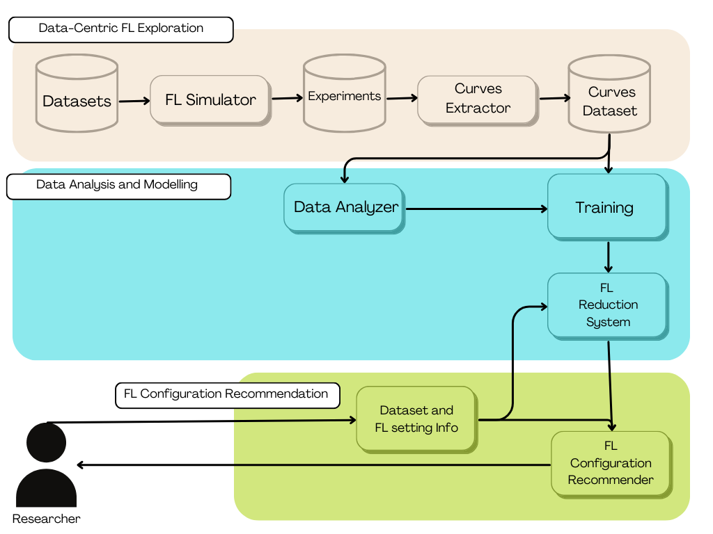

# 🌳 Eco-Friendly AI: Unleashing Data Power for Green Federated Learning

---

## 📚 Description 
This repository proposes a Data-Centric approach to Energy-Efficient Federated Learning, addressing the environmental footprint of Federated Learning while maintaining Machine Learning performances. It borns to investigate the role of data quality measures at each network node and develop a methodology to optimize data selection in the Federated Learning training process, aiming to reduce the energy consumption and carbon emissions of AI training in a Federated environment.

The Eco Friendly Federated Learning Platform has been developed to support the research study 👉🏽 [Read Paper](https://www.politesi.polimi.it/retrieve/db221856-83e5-4aac-a2bf-99cb652d6195/Green_Federated_Learning__a_Data_Centric_Approach_in_the_Cloud_Continuum_Extended_Summary.pdf)



## ⭐️ Features
Experiment and run Federated Learning Simulations, powered by [Flower.ai](https://flower.ai), on your local machine with your own datasets for Time Series Classification tasks

### 🖥️ Federated Learning Simulator
  * **Dataset Partitions**: Define the source Dataset for your training session and the number of Federated Learning clients 
  * **Data Quality Poisoning**: Configure the Data Quality Dimensions measure of client data partitions
  * **Training Strategy**: Choose which node strategy selection suits best for your training session

### 🔮 Federated Learning Recommender
  * **Federated Configuration**: Insert the Data Characteristic and the Energy Mix info required per each node of your Federated environment
  * **Recommender Methodology**: Select and test one of the Recommender Methodolgy proposed
  * **Simulation**: Test Federated Learning training with your optimized Configuration 

## ⚙️ Getting Started

1. Clone the repository:
```bash
git clone https://github.com/POLIMIGreenISE/ecoFL.git
```

2. Install dependencies:
```bash
pip install -r requirements.txt
```
> Note: Requirements are optimized for MacOS. Adjust as needed for your operating system.

3. Launch the application:
```bash
streamlit run frontend/main.py
```

4. Start simulating! 🚀

## 📒 Notes
  1. The datasets that can be inserted as input, at the moment must be reported in .txt format and defined with the schema used by the datasets from the [The UEA   multivariate time series classification archive, 2018](https://www.timeseriesclassification.com) which have been used for the research project.
  2. Inside the directory 'data_nodes' the results from the research experimentation are present, the platform is now upgraded and saves the results with a new schema.

## 💭 Future Work
  1. Collect more experimental data points to improve the training of the reduction model used in the Recommender Methodologies
  2. Retrieve carbon intensity values of the nodes from the location throgh ElectricityMaps API

## 👥 Contribution
We welcome contributions! Feel free to submit pull requests or open issues to help improve the project.
    